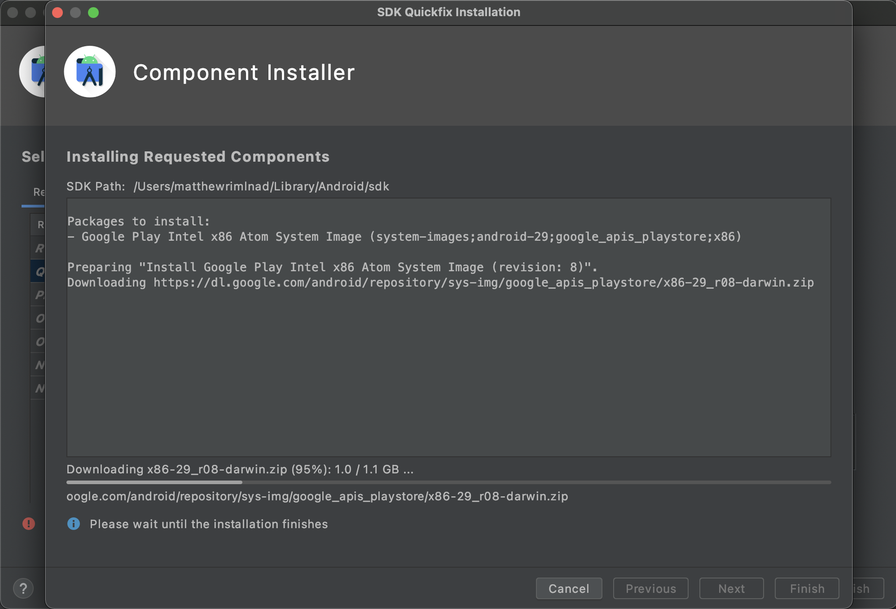

## UChica Go!: Pokémon Go! physical movements and their impact

The following is a project meant to illuminate possible underlying ulterior motives behind AR games, with a particular focus on Pokémon Go!

You can experience the game at https://mrimland.github.io/

## Pokémon Go!

Pokémon Go! is an Augmented Reality game that swept the US during Summer 2016. AR games inject game elements into our own world through smartphone elements such as a camera. The game, developed by Niantic, uses well known pokémon as ways to attract players and keep them playing. The appeal then is being able to see these creatures who were normally locked behind deviced "interact" with the world around us. 

However, such an enticing premise can often lead people to lose track of where they are in real life. As a result, especially early in the game, they would often trespass, or wander in search of pokémon.

https://www.denverpost.com/2016/07/13/pokemon-go-players-risking-arrest-trespassing/

In addition, "rare pokémon" sightings would often summon throngs of people to completely bypass societal norms in the hopes of trying to capture a digital creature. 

https://www.youtube.com/watch?v=mOpywxnPM_Q

The goal of this project then is to ask the question of whether such power over human psychology can be leveraged. The existence of tools such as "pokémon lures" as a means to attract players to certain spots is especially troubling. This project isn't meant to combat a problem that already exists, but rather address the potential issues that a location tracking app on your phone can have. What kind of information can be extracted based on your walking patterns? How specifically can apps influence your movement through "pokémon?" How can lures be used in a similar manner?

### Prototype Videos
As a prototype, I enlisted a friend to help test my functionality, largely to test out pathing options and how they would traverse from one point to get to a "pokémon." In addition, after the path was complete, I asked him a few questions regarding whether he was aware of his path, the overall structure, as well as his eventual thoughts after I revealed the purpose of my project.

The videos are down below

https://www.youtube.com/watch?v=YbbJu6sRcuc

https://www.youtube.com/watch?v=QBC_sYZjoyY

Note: I tried to replicate the experience that a mobile app would give, and how I want my eventual project to be experienced. I did not let my friend know what my project was about. I also did not tell him the path, nor what to do until we met up. The actual pathing was formatted so I went to a specific location to act as a "pokémon" and then beckoned for him to come to me. 

## This website
The website here is a demo meant to focus on the UChicago quad and campus. Here, students are tasked with moving around a character to capture gargoyles. In addition, there also may be "lures" placed down that can make more gargoyles come down. The site presents choice to an extent, trying to simulate a game similar to Pokémon Go! By trying to make the experience fun, my goal is to cloud people from seeing or thinking about larger issues such as the path they are taking or why they are even playing the game to begin with. 

## The future

I had issues with trying to develop an android app at least on my local machine with trying to emulate an android device. However, the next step for this project would be to develop an android app revolving around this premise. Especially given how specific the location permissions for android apps can be, it would probably be the most clear form for this project to take. In addition, an app would provide the closest experience to an app such as Pokémon Go!, which is what this project is attempting to replicate. Next, the app itself should use this location data to trace out the actual path taken by the user, as specifically as possible. This would help to reinforce the eventual confrontation stage of the app.

## Support or Contact
If you wish to reach out, there is the feedback form that can be found after completing one cycle of the web demo. Otherwise, feel free to reach out at mrimland@gmail.com regarding possible development of the app or feedback.

